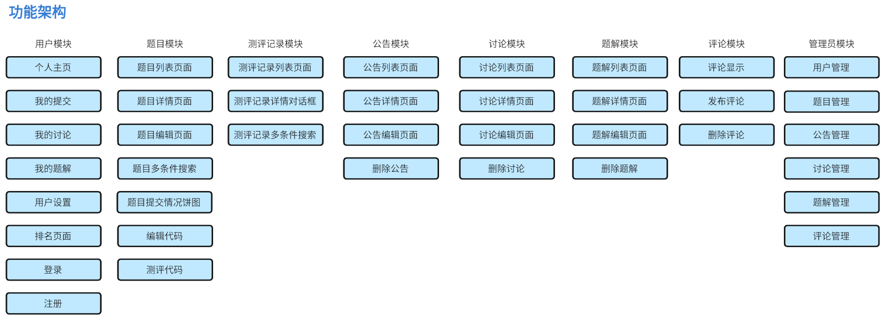
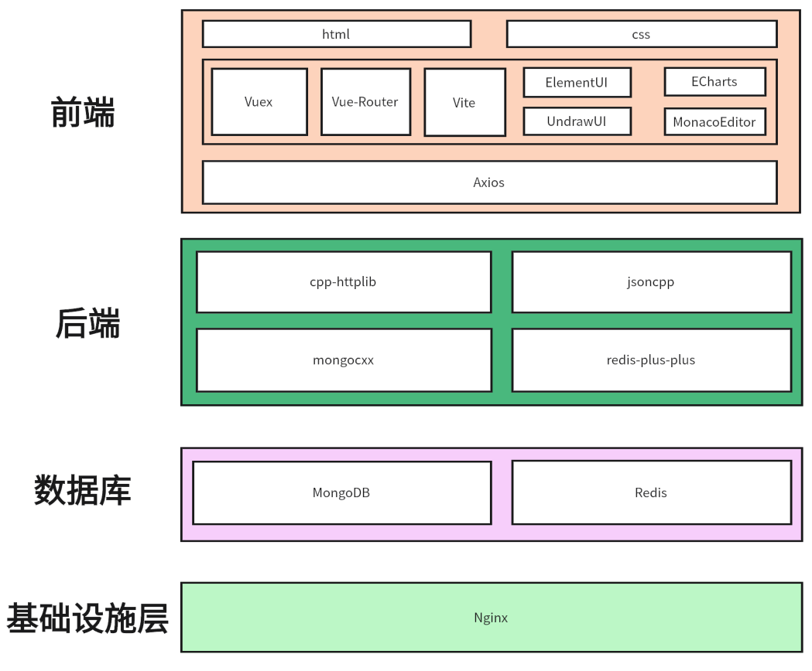

# 从零开始打造 Online Judge

在当前的信息化社会中，计算机科学和技术的发展已经渗透到了各个领域。在线评测系统，即 Online Judge
系统，作为一种新型的评测方式，已经成为计算机科学教育和竞赛活动中的重要工具。它不仅能够提高评测的效率和准确性，还为参与者提供了一个便捷、高效的学习和交流平台。

## 项目价值

OJ 是 Online Judge 系统的的简称，用来在线检测程序源代码的正确性。OJ
系统能够编译并执行代码，使用预设的数据对这些程序进行测试。提交的代码一般会在受限的环境下运行，包括时间限制、内存限制、安全限制等。

本项目将会从项目设计、项目后端开发、项目前端开发和项目部署四个阶段循序渐进完成对项目的整体构建。项目采用前后端分离架构，基于模块开发，涉及到
**用户模块**、**题目模块**、**公告模块**、**讨论模块**、**题解模块**、**评论模块**、**测评记录模块**和**判题模块**。

## 项目特色

* 手把手教你从零开始搭建项目，逐步提升系统分析能力
* 项目完成了 OJ 系统基本功能，并加入题解、评论等社交功能
* 实践项目页面简洁实用，交互效果完美
* 技术栈新颖且知识点丰富，学习后可提升理解和掌握，有助于市场竞争力

## 功能架构

## 技术架构

